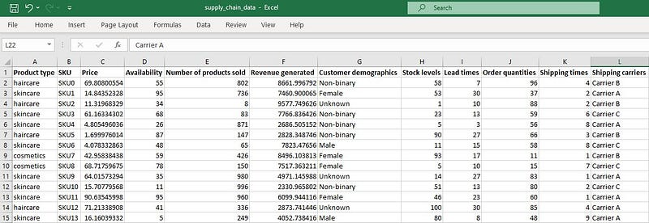
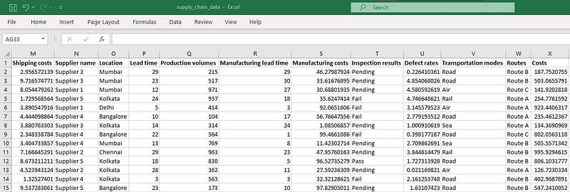
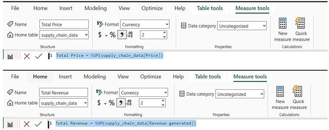
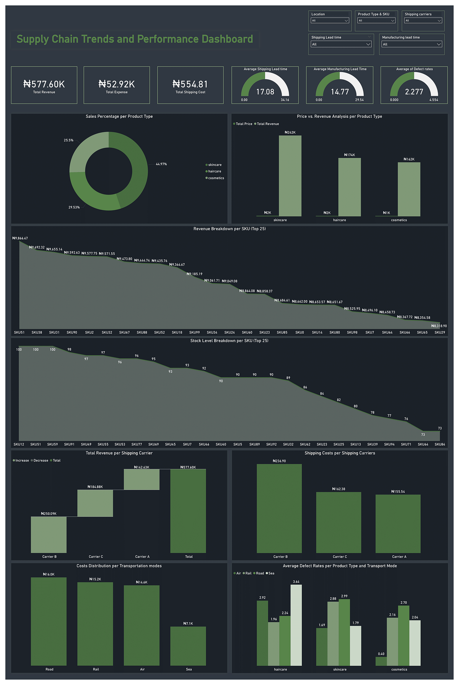

# Supply-Chain-Performance-Analysis-with-Power-BI

This project analyzes the supply chain performance of a fashion and beauty startup, focusing on the production and logistics network responsible for delivering products to customers. It provides insights into critical aspects such as product pricing, revenue generation, shipping efficiency, stock management, and defect rates. The objective is to identify areas for improvement, optimize shipping and inventory management, and offer recommendations to enhance overall efficiency and profitability.

## About the Data:
The source of my data was Quantum Analytics, a teaching organization dedicated to helping Africans and people of colour upskill and transition into tech careers and global opportunities.

The data is a CSV file that contains several key variables (24 columns) crucial for supply chain and product management analysis. These variables include product types, stock levels, revenue generated, customer demographics, and more, all aimed at providing a comprehensive view of product performance, availability, and logistics metrics.

*Figure 1: Suppy Chain Data 1*

*Figure 2: Suppy Chain Data 2*

## Methodology:
For this project, I utilized Power BI to mine and analyze the data, following these key steps:

+ I imported the dataset into Power BI, ensuring all relevant tables and columns were properly loaded.
+ I cleaned and transformed the data using Power BI's Power Query Editor. This included handling missing values, correcting data types, and filtering out unnecessary information to ensure accuracy and consistency.
+ I created calculated columns and measures to gain new insights and make it easier to compare different pieces of information within the table.

*Figure 3: Examples of Calculated Measures Created*

## Dashboard:
I came up with six cards showcasing KPIs, including total revenue, total cost, average defect rates, etc., all of which highlight key metrics related to performance. I also generated eight visuals which answered several business case questions, including the percentages of sales generated by the respective products, the total revenue generated by the various shipping carriers, shipping costs by carriers, etc.

*Figure 4: Supply Chain Dashboard*

## Insights:
+ Skincare products lead in total sales (44.97%) and revenue (₦242K).
+ Twelve SKUs generated over ₦9K each, with SKU51 being the highest at ₦9,866.47.
+ SKU12, SKU51, and SKU59 have the highest stock levels at 100.
+ Carrier B leads in revenue generation (₦250.09K) and incurs the highest shipping cost (₦236.90).
+ Road transport is the most used transportation mode.
+ Haircare products have the highest defect rates when transported by sea, while cosmetics and skincare products have the highest defect rates when transported by road.

## Recommendations:
+ Increase marketing efforts and ensure sufficient inventory levels for skincare products to capitalize on demand and further enhance revenue growth.
+ Prioritize restocking top-performing SKUs like SKU51, SKU12, and SKU38 to prevent stockouts, while adjusting stock levels of lower-performing SKUs to optimize resources.
+ Strengthen partnership with Carrier B as it generates the highest revenue (₦250.09K) but also conduct a cost-benefit analysis to ensure the revenue offsets the higher shipping costs.
+ Diversify transport methods by utilizing sea and rail, which have lower costs, for certain product types or regions. This can help achieve cost savings while maintaining operational efficiency.
+ Implement stricter quality control measures for haircare products during road transport and explore alternative transport modes to reduce defect rates and enhance product quality.

Check out my live analysis on LinkedIn for detailed insights on this project: [Supply Chain Trends and Performance Dashboard](https://www.linkedin.com/posts/kristin-adeoti-profile_dataanalytics-powerbi-datavisualization-activity-7251227058452779008-pTsg?utm_source=share&utm_medium=member_desktop)